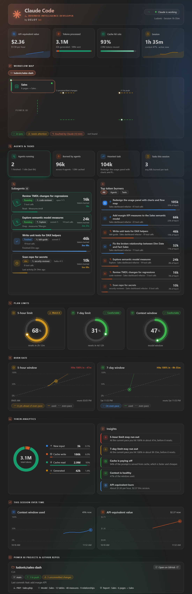

# Claude Code · Business Intelligence Developer

**by DELOT (v)**

A live dashboard for [Claude Code](https://claude.com/claude-code) inside VS Code. It shows what Claude is doing and what it costs you, and maps the Git and Power BI work in progress.



## What you get

| Section | What it shows |
|---|---|
| **Status bar** | `5h 68% · 7d 31% · ctx 47%` plus `$(organization) N` while subagents are running. Turns amber/red near the limits. |
| **KPI tiles** | API-equivalent value and $/hour, tokens processed (stacked bar), cache hit rate, session time. |
| **Workflow map** | Animated SVG flow: **Local folder → Git → GitHub** and **PBIP → Semantic models → Reports**. Nodes glow when Claude touched them in the last 10 minutes. |
| **Agents & tasks** | Subagents running right now (live timer, current tool call), finished and idle ones, plus **Top token burners** ranked across agents and prompts. |
| **Plan limits** | 5-hour, 7-day and context gauges with status badges. |
| **Burn rate** | Usage over each window vs. an even pace, a projection, and "hits 100% in ~X" warnings. Hover for exact values. |
| **Token analytics** | Donut breakdown (new input, cache write, cache read, generated) and automatic insights. |
| **Session trends** | Context and cost over the current session. |
| **Projects & changes** | Repos, branches, uncommitted/ahead/behind counts, Power BI models/reports and a feed of edits. |

A sticky section menu highlights where you are. Light, dark and high-contrast themes follow VS Code, and status colors come from your theme. Animations respect `prefers-reduced-motion`.

## How it works

Two small pieces:

1. **`mod/usage-band`**: a Claude Code mod that records limits, context, tokens, cost, repos and edits into `~/.claude/usage-band/state.json`.
2. **`extension/`**: the VS Code extension. It reads that file, scans your local session transcripts under `~/.claude/projects/` for subagents and per-task token usage, and renders the panel.

Everything stays on your machine. Nothing is sent anywhere. The panel runs under a strict Content Security Policy with no external requests.

## Install

### 1. The mod (data source)

Copy `mod/usage-band` to `~/.claude/skills/usage-band` (on Windows: `%USERPROFILE%\.claude\skills\usage-band`) and restart Claude Code. Run `/usage-band` to check it responds.

### 2. The VS Code extension

```bash
cd extension
npx @vscode/vsce package --allow-missing-repository --no-dependencies
code --install-extension claude-usage-bar-0.3.0.vsix
```

Reload VS Code. The item appears at the right of the status bar. Click it, or run **Claude Code: Open usage dashboard**.

Settings (all optional):

| Setting | Default | What it does |
|---|---|---|
| `claudeUsageBar.userName` | global `git user.name` | Name shown in the dashboard. |
| `claudeUsageBar.pollIntervalMs` | `2000` | Refresh interval (min 1000). |
| `claudeUsageBar.notifications` | `true` | Warn when a plan limit crosses a threshold. |
| `claudeUsageBar.notifyAt` | `[80, 95]` | Usage percentages that trigger a warning. |

Commands: **Claude Code: Open usage dashboard** and **Claude Code: Export usage history (CSV)**.

## Develop

```bash
npm test                     # unit tests + coverage (Node 20+, no dependencies)
node tools/preview.js dark   # writes tools/preview-dark.html with mock data
```

Open the generated file in a browser to iterate on the UI without VS Code.

```
extension/
  extension.js    status bar item, polling, notifications, CSV export
  format.js       formatters shared by the host and the webview
  history-csv.js  usage history to CSV
  activity.js     reads session + subagent transcripts (incremental, cached)
  panel.js        HTML skeleton
  analytics.js    pace, projections, insights
  charts.js       SVG charts with hover tooltips, donut
  agents-view.js  subagents and token-burner ranking
  flow-view.js    Git / Power BI workflow map
  webview.js      rendering and live updates
mod/usage-band/   the Claude Code mod
test/             node:test suites (analytics, activity, format, CSV, panel)
```

## Notes and limits

- Token "burned" = new input + cache writes + generated tokens. Cache reads are reported separately because they would dwarf everything else.
- Cost is the **API-equivalent value** of your usage, not what a subscription bills you.
- Subagent status is inferred from transcripts: *running* means activity in the last 90 s.
- Power BI detection expects PBIP projects (`*.pbip`, `*.SemanticModel`, `*.Report`).

## En español

Panel en vivo para Claude Code dentro de VS Code: límites del plan (5 h / 7 d), tokens, subagentes en ejecución, ranking de tokens quemados por tarea y un mapa de flujo Local → Git → GitHub y PBIP → Modelos → Informes. Instalación: copia `mod/usage-band` a `~/.claude/skills/usage-band`, empaqueta la extensión con `vsce` e instálala con `code --install-extension`.

## License

Apache-2.0 © DELOT (v). See [LICENSE](LICENSE) and [NOTICE](NOTICE).

You can use, modify and redistribute this freely, including commercially. Keep the license and the NOTICE file with your copies.
